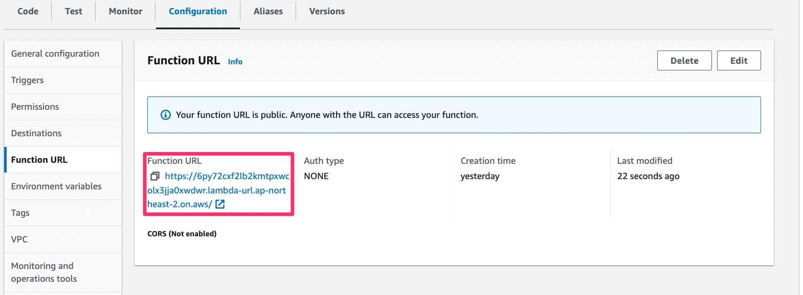
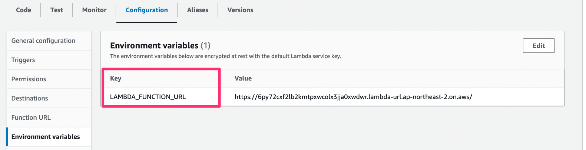

# aws-lambda-url-with-powertools


```shell
$ cdk deploy SimpleWebSite/AppInfra
```

The functions list in the AWS Lambda console, click simple-lambda-web, then go to Configuration -> Function URL
Copy the Function URL



go to Configuration -> Environment variables, there will be LAMBDA_FUNCTION_URL key with YOUR_LAMBDA_URL value,
replace YOUR_LAMBDA_URL with the Function URL you just copied.



